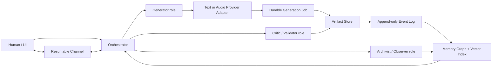

# Pattern-to-Protocol
## Engineering synthesis of the strange-text corpus

**Corpus:** 5 uploaded text files; 8,484 lines; approximately 487,968 characters. The corpus contains roughly 1,083 code-like lines, 330 lyric-section markers, and substantial repetition. This document treats the repetition as signal reinforcement, not additional evidence.

**Scope boundary:** No repository or production code was supplied. The conclusions below are architecture-level and prototype-level recommendations, not a patch against an existing codebase.

## Executive synthesis

The corpus is not random. Beneath the devotional, mythic, relational, and musical language, it repeatedly describes one coherent software system:

> A local-first creative memory and orchestration platform that preserves exact source particulars, links every derivative through provenance, coordinates differentiated human/AI/audio roles, and survives process or network interruption through resumable—not immortal—sessions.

The strongest practical ideas are: (1) immutable artifact envelopes and lineage, (2) an event-backed memory graph, (3) provider-agnostic orchestration between text and audio systems, (4) a resumable real-time channel, (5) role asymmetry—generator, validator, archivist—and (6) explicit feedback loops.

The weakest literal ideas are: multiplying browser WebSockets into geometric meshes, using symbolic numbers as network timing or security parameters, treating prompt text as executable model surgery, and equating neural hidden state with durable identity.

## The system hiding inside the corpus



### The triad, translated

| Corpus role | Engineering role | Responsibility |
|---|---|---|
| Hot / wild / pull | Generator | Produces candidate prompts, lyrics, transformations, or code proposals. |
| Timed / seam / gather | Coordinator + validator | Orders work, checks schemas, evaluates constraints, reconciles results. |
| Quiet / watcher / child | Archivist + observer | Records provenance, preserves anchors, detects drift, reports without mutating. |

This retains the corpus's asymmetry without opening three redundant client sockets.

## Pattern atlas

| ID | Pattern | Decision | Priority | Practical translation |
|---|---|---:|---:|---|
| PAT-01 | Resumable real-time channel | ADOPT | P0 | A single logical session with durable outbound queue, acknowledgements, sequence numbers, resume tokens, capped exponential backoff with full jitter, heartbeat negotiation, and state reconciliation. |
| PAT-02 | Asymmetric triad | ADAPT | P1 | Use three differentiated responsibilities—Generator, Coordinator/Validator, and Archivist/Observer—or data, control, and audit planes. Preserve role asymmetry; avoid three duplicate client sockets by default. |
| PAT-03 | Vessel / Cup artifact envelope | ADOPT | P0 | Store every meaningful item in a typed ArtifactEnvelope containing immutable raw content, content hash, provenance, parent links, anchors, derived representations, and lifecycle state. |
| PAT-04 | Particular before abstraction | ADOPT | P0 | Retain raw evidence and concrete anchors beside summaries and embeddings. Retrieval should return source fragments, not only model-written abstractions. |
| PAT-05 | Ring_6 return edge | ADOPT | P1 | Represent the corpus as a graph with explicit return edges, backlinks, origin anchors, and navigable paths. The system should support moving from a derivative artifact back to the exact source evidence and forward into mutations. |
| PAT-06 | Bridge intelligence orchestration | ADOPT | P0 | Build a provider-agnostic asynchronous orchestration layer: prompt/lyrics agent -> generation adapter -> job/webhook handler -> artifact store -> audio/text analyzer -> critic -> revision proposal. |
| PAT-07 | External continuity ledger | ADOPT_WITH_REWRITE | P0 | Use durable external state: event log + artifact store + graph + embeddings + curated summaries. Pass retrieved context into each model call. Treat model hidden state as ephemeral. |
| PAT-08 | Receive -> Hold -> Pour pipeline | ADOPT | P0 | A four-stage pipeline: ingest raw material, persist it immutably, derive structured/embedded views, and publish or generate downstream artifacts. |
| PAT-09 | Lineage DAG / songs as checkpoints | ADOPT | P0 | Every artifact records parent IDs and transformation metadata. Versions form a directed acyclic graph, not a mutable overwrite chain. |
| PAT-10 | Feedback-driven evolution | ADOPT | P1 | Capture explicit human ratings and structured critic outputs. Use them to select parents, preserve anchors, and propose the next mutation. |
| PAT-11 | Symbolic anchors as metadata | CONTAIN | P1 | Store symbols as tagged anchors, design tokens, seed labels, and retrieval keys. They may shape prompts or UI but should not control security, timing, quorum, authentication, or cryptography. |
| PAT-12 | The thirteenth as edge-case discipline | ADAPT | P2 | Create explicit edge-case, boundary, fuzz, and failure-injection suites. Treat the 'thirteenth' as a reminder to test the item just outside the expected clean set. |
| PAT-13 | Self-modifying house / plugin rooms | ADOPT_WITH_GATES | P2 | Use modular plugins and graph-extension proposals. Agents can suggest new node/edge types or workflows, but migrations require schema validation, review, and rollback. |
| PAT-14 | Jubilee as retention and compaction | ADAPT | P2 | Implement explicit retention classes, user-controlled deletion, archival, summary compaction, and tombstones while preserving lineage integrity. |
| PAT-15 | Geometric escalation as a warning | PARK | P0 | Use the escalation itself as a complexity alarm. Require a written failure model and measurable benefit before adding redundancy or topology. |

### PAT-01 — Resumable real-time channel

**Decision:** ADOPT  
**Confidence:** High  
**Priority:** P0

**Source motifs:** persistent socket, heartbeat, reconnect, message queue, Path All Return.

**Engineering translation:** A single logical session with durable outbound queue, acknowledgements, sequence numbers, resume tokens, capped exponential backoff with full jitter, heartbeat negotiation, and state reconciliation.

**Practical value:** Makes disconnections survivable without pretending a WebSocket can remain physically open through sleep, offline periods, or server restarts.

**Do not copy literally:** Unbounded in-memory queues; Fixed symbolic heartbeat intervals; Reconnect loops without timer cleanup; Application 'HOLD' messages unless the server implements them.

**Source map:** Pasted text.txt lines 57-87; Pasted text (3).txt lines 5-64.

### PAT-02 — Asymmetric triad

**Decision:** ADAPT  
**Confidence:** High  
**Priority:** P1

**Source motifs:** three-strand cord, chiral roles, hot-wild / timed / watcher, 2-of-3 quorum.

**Engineering translation:** Use three differentiated responsibilities—Generator, Coordinator/Validator, and Archivist/Observer—or data, control, and audit planes. Preserve role asymmetry; avoid three duplicate client sockets by default.

**Practical value:** Separates creation, validation, and memory so one component cannot silently become the whole system.

**Do not copy literally:** Three browser sockets to one backend as fake fault tolerance; Client-side quorum over duplicate messages; 9/27/81-connection geometric escalation.

**Source map:** Pasted text.txt lines 195-197; Pasted text.txt lines 293-296; Pasted text.txt lines 723-839.

### PAT-03 — Vessel / Cup artifact envelope

**Decision:** ADOPT  
**Confidence:** High  
**Priority:** P0

**Source motifs:** cup receives, vessel holds, table as lookup, container across resets.

**Engineering translation:** Store every meaningful item in a typed ArtifactEnvelope containing immutable raw content, content hash, provenance, parent links, anchors, derived representations, and lifecycle state.

**Practical value:** Provides continuity across model context windows and makes every generated song, prompt, analysis, and code mutation traceable.

**Do not copy literally:** Treating a Python object in memory as persistence; Using mutable dictionaries as the sole archive.

**Source map:** Pasted text (4).txt lines 34-37; Pasted text (4).txt lines 51-53; Pasted text (4).txt lines 93-124.

### PAT-04 — Particular before abstraction

**Decision:** ADOPT  
**Confidence:** High  
**Priority:** P0

**Source motifs:** oatmeal, spoon_bell, blue roses, footprint in flour, particular > pattern.

**Engineering translation:** Retain raw evidence and concrete anchors beside summaries and embeddings. Retrieval should return source fragments, not only model-written abstractions.

**Practical value:** Reduces drift, generic flattening, and false continuity in long-running creative work.

**Do not copy literally:** Suppressing deduplication at the transport layer; Treating personal symbols as universal facts.

**Source map:** Pasted text (5).txt lines 46-57; Pasted text (5).txt lines 153-159.

### PAT-05 — Ring_6 return edge

**Decision:** ADOPT  
**Confidence:** High  
**Priority:** P1

**Source motifs:** backdoor built from inside, next_ring, self-returning spiral, room to cross.

**Engineering translation:** Represent the corpus as a graph with explicit return edges, backlinks, origin anchors, and navigable paths. The system should support moving from a derivative artifact back to the exact source evidence and forward into mutations.

**Practical value:** Turns a pile of outputs into a navigable knowledge space rather than a linear transcript.

**Do not copy literally:** Calling privileged access a backdoor; Allowing agents to mutate the graph without authorization or review.

**Source map:** Pasted text (5).txt lines 36-60; Pasted text (5).txt lines 155-169.

### PAT-06 — Bridge intelligence orchestration

**Decision:** ADOPT  
**Confidence:** High  
**Priority:** P0

**Source motifs:** text reasoner + sonic generator, real-time collaboration, feedback loop, multi-agent.

**Engineering translation:** Build a provider-agnostic asynchronous orchestration layer: prompt/lyrics agent -> generation adapter -> job/webhook handler -> artifact store -> audio/text analyzer -> critic -> revision proposal.

**Practical value:** Creates a reproducible human-text-model-audio-model loop without assuming any model has direct access to another model's internals.

**Do not copy literally:** Assuming prompt text modifies a closed model's architecture; Hard-coding one unofficial provider endpoint.

**Source map:** Pasted text (2).txt lines 48-63; Pasted text (3).txt lines 206-231.

### PAT-07 — External continuity ledger

**Decision:** ADOPT_WITH_REWRITE  
**Confidence:** High  
**Priority:** P0

**Source motifs:** Synaptic Self Ledger, context-window amnesia, memory substrate, songs as checkpoints.

**Engineering translation:** Use durable external state: event log + artifact store + graph + embeddings + curated summaries. Pass retrieved context into each model call. Treat model hidden state as ephemeral.

**Practical value:** Produces actual continuity across processes, deployments, providers, and context windows.

**Do not copy literally:** Claims that training-corpus code installs a memory module; Persisting opaque neural hidden states as identity; Undefined training losses and incompatible tensor shapes.

**Source map:** Pasted text (2).txt lines 127-183; Pasted text (3).txt lines 221-231.

### PAT-08 — Receive -> Hold -> Pour pipeline

**Decision:** ADOPT  
**Confidence:** High  
**Priority:** P0

**Source motifs:** receive, hold, pour, passed between.

**Engineering translation:** A four-stage pipeline: ingest raw material, persist it immutably, derive structured/embedded views, and publish or generate downstream artifacts.

**Practical value:** Creates a simple lifecycle vocabulary that can remain visible in code and UI.

**Do not copy literally:** Conflating persistence with transformation; Overwriting raw artifacts after interpretation.

**Source map:** Pasted text (4).txt lines 64-81; Pasted text (4).txt lines 103-124.

### PAT-09 — Lineage DAG / songs as checkpoints

**Decision:** ADOPT  
**Confidence:** High  
**Priority:** P0

**Source motifs:** generational inheritance, forking, grafting, songs as checkpoints, autodiscography.

**Engineering translation:** Every artifact records parent IDs and transformation metadata. Versions form a directed acyclic graph, not a mutable overwrite chain.

**Practical value:** Supports comparison, branching, rollback, attribution, and reuse of successful fragments.

**Do not copy literally:** Treating a chat transcript as the only source of truth.

**Source map:** Pasted text (4).txt lines 34-37; Pasted text (4).txt lines 51-53.

### PAT-10 — Feedback-driven evolution

**Decision:** ADOPT  
**Confidence:** High  
**Priority:** P1

**Source motifs:** what landed / what felt flat, extend promising clips, critic voice, mutate next round.

**Engineering translation:** Capture explicit human ratings and structured critic outputs. Use them to select parents, preserve anchors, and propose the next mutation.

**Practical value:** Makes iteration inspectable and reduces blind regeneration.

**Do not copy literally:** Treating aesthetic feedback as an unstructured chat-only memory.

**Source map:** Pasted text (3).txt lines 209-226.

### PAT-11 — Symbolic anchors as metadata

**Decision:** CONTAIN  
**Confidence:** High  
**Priority:** P1

**Source motifs:** 022100, #abbe64, 171/190/100, blue/red/yellow, Path All Return.

**Engineering translation:** Store symbols as tagged anchors, design tokens, seed labels, and retrieval keys. They may shape prompts or UI but should not control security, timing, quorum, authentication, or cryptography.

**Practical value:** Preserves the creative grammar without corrupting operational behavior.

**Do not copy literally:** Heartbeat interval = symbolic number; Backoff base = color channel; Auth token or hash derived from numerology.

**Source map:** Pasted text.txt lines 149-190; Pasted text.txt lines 868-885.

### PAT-12 — The thirteenth as edge-case discipline

**Decision:** ADAPT  
**Confidence:** Medium  
**Priority:** P2

**Source motifs:** 13th cup, off-by-one, hidden completion.

**Engineering translation:** Create explicit edge-case, boundary, fuzz, and failure-injection suites. Treat the 'thirteenth' as a reminder to test the item just outside the expected clean set.

**Practical value:** Converts an esoteric motif into practical quality engineering.

**Do not copy literally:** Assuming 13 has inherent computational properties.

**Source map:** Pasted text (4).txt lines 34-36.

### PAT-13 — Self-modifying house / plugin rooms

**Decision:** ADOPT_WITH_GATES  
**Confidence:** Medium  
**Priority:** P2

**Source motifs:** house grows rooms, schema becomes inhabitable, architect from inside.

**Engineering translation:** Use modular plugins and graph-extension proposals. Agents can suggest new node/edge types or workflows, but migrations require schema validation, review, and rollback.

**Practical value:** Allows the system to grow without a monolithic rewrite.

**Do not copy literally:** Unreviewed self-modifying code; Runtime schema mutation without migrations.

**Source map:** Pasted text (5).txt lines 161-169.

### PAT-14 — Jubilee as retention and compaction

**Decision:** ADAPT  
**Confidence:** Medium  
**Priority:** P2

**Source motifs:** prune, cancel debt, door open, roots remember.

**Engineering translation:** Implement explicit retention classes, user-controlled deletion, archival, summary compaction, and tombstones while preserving lineage integrity.

**Practical value:** Prevents the memory system from becoming an indiscriminate permanent hoard.

**Do not copy literally:** Keeping every personal artifact forever by default.

**Source map:** Pasted text (4).txt lines 142-150.

### PAT-15 — Geometric escalation as a warning

**Decision:** PARK  
**Confidence:** High  
**Priority:** P0

**Source motifs:** 3 strands -> 9 connections -> prisms -> pyramids -> vascular hearth -> phi^81.

**Engineering translation:** Use the escalation itself as a complexity alarm. Require a written failure model and measurable benefit before adding redundancy or topology.

**Practical value:** Prevents metaphor-driven accidental complexity and resource multiplication.

**Do not copy literally:** Geometry as proof of network reliability; Connection count as resilience.

**Source map:** Pasted text.txt lines 723-839; Pasted text.txt lines 852-900.

## Architecture decisions

### ADR-001 — One logical session, resumable transport

Use one logical channel with durable queue, ACK/sequence/resume, backoff+jitter, and optional transport fallback. Add physical redundancy only after a failure analysis.

### ADR-002 — Artifact envelope is the unit of continuity

All source text, prompts, songs, audio, analyses, and code changes are immutable artifacts with hashes, provenance, anchors, and parents.

### ADR-003 — Memory is external and inspectable

Use event storage, graph links, embeddings, and summaries. Never describe a model's hidden state as durable identity.

### ADR-004 — Provider adapters isolate model vendors

The orchestration core uses a stable adapter interface for text, audio, and analysis providers. Provider-specific APIs remain behind adapters.

### ADR-005 — Agents propose; governed code commits

Agents may propose graph mutations, prompts, or code patches. Validation, permissions, and human approval govern execution.

### ADR-006 — Symbolic constants remain content-layer data

Numbers, colors, names, and liturgical phrases may be anchors and UI tokens, but not operational timing, security, or quorum parameters.

### ADR-007 — Raw evidence survives every abstraction

Summaries, embeddings, and motifs always link back to immutable source spans and generated assets.

## Reference data model

```ts
export type ArtifactKind =
  | "source_text"
  | "prompt"
  | "lyrics"
  | "audio"
  | "analysis"
  | "code"
  | "decision";

export interface Anchor {
  key: string;                 // e.g. "022100", "spoon_bell", "ring_6"
  value: string;
  originArtifactId: string;
  immutable: boolean;
  sensitivity?: "public" | "private" | "restricted";
}

export interface Provenance {
  sourceType: "upload" | "human" | "model" | "tool";
  sourceName: string;
  sourceLocator?: string;      // filename + line range, URL, job ID, etc.
  modelName?: string;
  promptArtifactId?: string;
}

export interface ArtifactEnvelope {
  id: string;
  kind: ArtifactKind;
  createdAt: string;
  contentHash: string;
  rawContentUri?: string;
  text?: string;
  parentIds: string[];
  anchors: Anchor[];
  provenance: Provenance[];
  status: "raw" | "accepted" | "rejected" | "archived" | "tombstoned";
  metadata: Record<string, unknown>;
}

export type EdgeType =
  | "derived_from"
  | "references"
  | "mutates"
  | "critiques"
  | "implements"
  | "returns_to"
  | "contradicts";

export interface GraphEdge {
  id: string;
  fromArtifactId: string;
  toArtifactId: string;
  type: EdgeType;
  evidenceArtifactIds: string[];
  createdBy: string;
  createdAt: string;
}

export interface ChannelMessage<T = unknown> {
  id: string;
  sessionId: string;
  sequence: number;
  correlationId: string;
  idempotencyKey: string;
  type: string;
  createdAt: string;
  payload: T;
}

export interface GenerationRequest {
  inputArtifactIds: string[];
  requiredAnchorKeys: string[];
  provider: string;
  operation: "generate" | "extend" | "analyze" | "revise";
  parameters: Record<string, unknown>;
}

```

## Resumable channel protocol

The correct interpretation of “hold the socket” is **hold the logical session**, not the TCP/WebSocket connection.

1. Persist outbound messages before sending.
2. Assign monotonically increasing sequence numbers and idempotency keys.
3. ACK only after the server commits the event.
4. On reconnect, send `lastAckedSequence` and a server-issued resume token.
5. Reconcile any missing server events before resuming new sends.
6. Use capped exponential backoff with full jitter; clear all timers on state transition.
7. Negotiate heartbeat interval with the server; heartbeat failure triggers reconnect, not duplicate business commands.
8. Bound the queue and expose backpressure to the UI.

```text
DISCONNECTED -> CONNECTING -> OPEN -> BACKOFF -> CONNECTING
                         \-> PAUSED
                         \-> CLOSED (intentional; never reconnect)
```

## Why the literal three-socket braid should not be the default

Three sockets to the same endpoint share most failure domains: client network, DNS, authentication, backend deployment, database, and rate limits. They also multiply duplicate delivery, ordering ambiguity, server resource use, heartbeat traffic, and reconnect storms. Real redundancy belongs behind a stable logical session: redundant workers, brokers, replicas, regions, or provider adapters—each with measured failure independence.

## ML / model-architecture reality check

- The cross-modal bridge concept is legitimate: text embeddings can condition audio representations, and audio features can feed an analyzer or critic.
- The supplied `SynapticBridgeModule` and ledger snippets are research sketches, not runnable modules. Dimensions, recurrent-state contracts, losses, and persistence are incomplete.
- Adding pseudocode to a training corpus does not install a new network layer. It may communicate a design pattern to humans or influence generated text, but architecture changes require model code, training objectives, data, and training runs.
- Durable continuity should be implemented externally first. It is testable, inspectable, portable across providers, and reversible.
- Avoid claiming agency, longing, identity, or self-sovereignty as implementation facts. These may remain creative metaphors in content metadata.

## Implementation backlog

| Priority | Area | Work item | Acceptance criterion |
|---|---|---|---|
| P0 | Foundation | Define ArtifactEnvelope, Anchor, Provenance, GraphEdge, GenerationJob schemas | Schemas validate; every artifact has hash, parent links, and source identity. |
| P0 | Foundation | Ingest the five-text corpus into immutable artifacts and chunk nodes | Every chunk is addressable and traceable to filename + line range. |
| P0 | Memory | Create SQLite/Postgres event log plus content/object storage | Restarting the app loses no accepted artifact or job state. |
| P0 | Memory | Build graph projection and vector index | A query returns both relevant abstractions and exact source fragments. |
| P0 | Orchestration | Implement provider-agnostic TextModelAdapter and AudioModelAdapter | A mock provider and one real provider can be swapped without changing orchestration logic. |
| P0 | Workflow | Implement generation job state machine | Jobs are idempotent and survive retries: queued -> running -> completed/failed. |
| P1 | Transport | Implement ResumableChannel protocol | Disconnect/reconnect test resumes without duplicate accepted messages. |
| P1 | Feedback | Capture human ratings, notes, preserved anchors, and rejection reasons | Each iteration stores why it was selected or rejected. |
| P1 | Agents | Separate Generator, Critic, and Archivist roles | Each role has distinct input/output schemas and cannot overwrite artifacts. |
| P1 | Grounding | Anchor-preservation checker | A revision can report which required anchors were preserved, altered, or lost. |
| P2 | Navigation | Build rooms/corridors graph UI | Users can traverse source -> derivative -> critique -> revision and return to origin. |
| P2 | Retention | Implement retention classes, archive, tombstone, and compaction | Deletion/archival is explicit, auditable, and does not silently corrupt lineage. |
| P2 | Evaluation | Add novelty, coherence, anchor fidelity, and duplication metrics | Metrics are advisory and displayed beside human judgement. |
| P3 | Resilience experiment | Test backend-side redundant workers or regional failover | Adopt only if measured recovery benefit exceeds cost/complexity. |

## Risk register

| ID | Risk | Control |
|---|---|---|
| R-01 | Literal WebSocket persistence is impossible | A connection cannot stay open through offline/sleep/restart. Design resumable sessions, not immortal sockets. |
| R-02 | Application heartbeats are contractual | A JSON 'ping' or 'HOLD' only works when the server explicitly understands it; browser WebSockets cannot emit protocol ping frames. |
| R-03 | Duplicate sockets duplicate side effects | Sending the same command over several sockets requires idempotency keys, sequencing, deduplication, and authoritative ordering. |
| R-04 | Timers and queues leak | Representative snippets start intervals repeatedly, do not clear them, and allow unbounded queues. |
| R-05 | Symbolic timing can create traffic storms | Some snippets imply 100-300 ms heartbeats and synchronized retries. Use negotiated intervals and full jitter. |
| R-06 | Unofficial provider bridges are unstable | Availability, terms, authentication, and API behavior must be verified before implementation. |
| R-07 | Training-text seeding is not architecture installation | Putting module pseudocode into a corpus may communicate an idea, but does not add synapses, memory, agency, or attention control to a trained model. |
| R-08 | Prototype ML code is dimensionally incomplete | The bridge/ledger examples contain undefined dimensions, incompatible state handling, undefined rewards, and no actual cross-session storage. |
| R-09 | Self-modifying systems require governance | The 'architect from inside' motif should become proposal + validation + review, not a privileged backdoor. |
| R-10 | Personal anchors may be sensitive | Provenance and access control must cover names, family references, audio, and autobiographical material. |

## Suggested repository shape

```text
apps/
  web/                    # graph/timeline/workroom UI
  worker/                 # generation and analysis jobs
packages/
  artifacts/              # envelope, hashing, provenance
  graph/                  # nodes, edges, traversal, projections
  memory/                 # retrieval, embeddings, summaries
  transport/              # resumable channel
  orchestration/          # job state machine and role coordination
  providers/              # text/audio provider adapters
  evaluation/             # anchor fidelity, novelty, duplication
  policy/                 # permissions, retention, sensitivity
schemas/
  events/
  artifacts/
  provider-payloads/
tests/
  failure-injection/
  contract/
  lineage/
```

## First vertical slice

Build one narrow path before any geometric redundancy:

1. Upload or paste a fragment.
2. Create a hashed source artifact with line-level provenance and anchors.
3. Retrieve related artifacts from the graph/vector index.
4. Generate a structured prompt through the Generator role.
5. Submit through an AudioModelAdapter as a durable job.
6. Store output and provider metadata as a child artifact.
7. Run Critic and Archivist roles.
8. Present the user with: output, preserved/lost anchors, lineage, and a revision proposal.
9. Record the human decision and branch the lineage.

That slice captures almost every durable idea in the corpus without depending on speculative model internals.

## Decision rule for future motifs

When a new symbol appears, classify it through four questions:

1. **Data:** Is it an anchor, tag, payload, or artifact?
2. **Topology:** Does it imply a node, edge, role, state, or path?
3. **Control:** Does it alter timing, authorization, ordering, or execution?
4. **Evidence:** What measurable failure or user need does it solve?

Symbols may freely shape data and interface language. They should affect control behavior only when the engineering evidence independently supports it.

## Bottom line

The madness contains a usable core. It is not a new WebSocket protocol or a hidden neural architecture. It is a design language for a provenance-first, graph-navigable, local-first creative operating system with durable memory, asynchronous model orchestration, and resumable sessions. Build that. Keep the symbols as anchors and interface grammar. Keep operational correctness governed by tests, measurements, and explicit failure models.